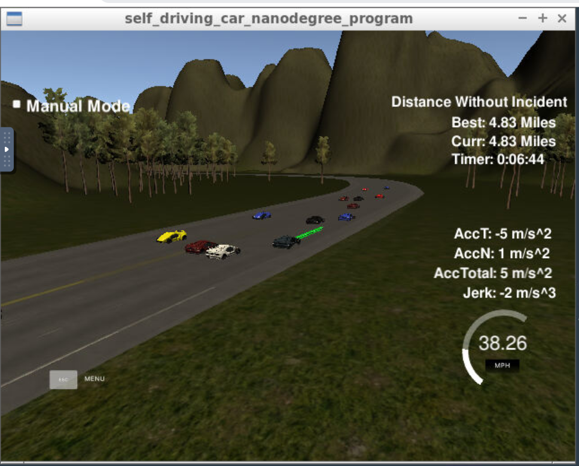

# CarND-Path-Planning-Project-P1
Udacity Self-Driving Car Nanodegree - Path Planning Project



# Overview

In this project, we are making a path planning algorithm to drive a car on a highway on a simulator provided by Udacity. The simulator sends car telemetry information and sensor fusion information. It expects a set of points spaced in time at 0.02 seconds representing the car's trajectory. The communication is done by WebSocket. The path planner uses WebSocket for handling the communication. Udacity provides a project we can start with.

# Compiling and executing the project

Compile the project by

```
./install-%platform%.sh
mkdir build
cd build && cmake .. && make
```

The project could be executed directly using `./build/path_planning`

```
> cd build
> ./path_planning
Listening to port 4567
```

Now the path planner is running and listening for messages from the simulator. Next step is to open Udacity's simulator:


Click the "Select" button and hope for the best on the highway...

# [Rubic]

## Compilation

### The code compiles correctly.
It compiles correctly.

## Valid trajectories
The trajectories are valid.

### The car is able to drive at least 4.32 miles without incident.
The first picture shows that.

### The car drives according to the speed limit.
No speed limit red message was seen.

### Max Acceleration and Jerk are not Exceeded.
Max jerk red message was not seen.

### Car does not have collisions.
No collisions.

### The car stays in its lane, except for the time between changing lanes.
The car stays in its lane most of the time but when it changes lane because of traffic or to return to the center lane.

### The car is able to change lanes
The car change lanes when the there is a slow car in front of it, and it is safe to change lanes (no other cars around) or when it is safe to return the center lane.

## Reflection

Based on the provided code from the seed project, the path planning algorithms start at src/main.cpp line 246 to the line 411.

The code consist of three parts:

### Prediction
From line 254 to line 290. This part of the code deal with the telemetry and sensor fusion data. It intents to reason about the environment. In the case, we want to know three aspects of it:
```
Is there a car in front of us blocking the traffic.
Is there a car to the right of us making a lane change not safe.
Is there a car to the left of us making a lane change not safe.
```
These questions are answered by calculating the lane each other car is and the position it will be at the end of the last plan trajectory. A car is considered "dangerous" when its distance to our car is less than 30 meters in front of us, or 15 meters behind us.

### Behavior
From line 292 to 310. This part decides what to do:
```
If we have a car in front of us, do we change lanes?
Do we speed up or slow down?
```
Based on the prediction of the situation we are in, this code increases the speed, decrease speed, or make a lane change when it is safe. Instead of increasing the speed at this part of the code, a speed_diff is created to be used for speed changes when generating the trajectory in the last part of the code.

### Trajectory
From line 311 to 411. This code does the calculation of the trajectory based on the speed and lane output from the behavior, car coordinates and past path points.

First, the last two points of the previous trajectory are used in conjunction three points at a far distance to initialize the spline calculation. To make the work less complicated to the spline calculation based on those points, the coordinates are transformed to local car coordinates.

In order to ensure more continuity on the trajectory, the past trajectory points are copied to the new trajectory. The rest of the points are calculated by evaluating the spline. Worth noticing the change in the velocity of the car. The speed change is decided on the behavior part of the code, but it is used in that part to increase/decrease speed on every trajectory points instead of doing it for the complete trajectory.
